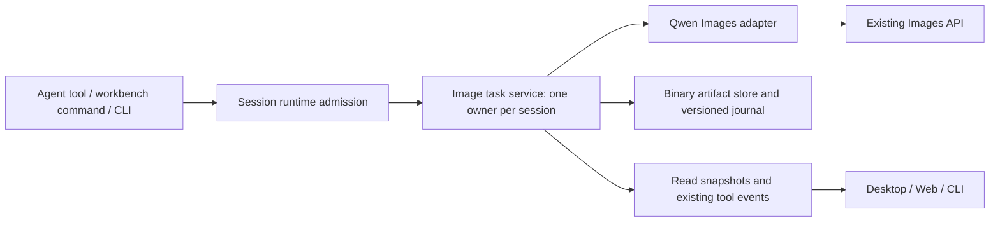

# Native image generation (v1)

Status: implementation in progress. Baseline: upstream 29628c9, ZCode 3.14.3.

## Product contract

An optional native `GenerateImage` tool and a bundled `image-generation` skill
provide generation and ordered-reference editing through an authenticated Images
API. Desktop and Web share a workbench. CLI/TUI use the same execution service.
The initial adapter is Qwen-Image-2.1. This feature does not implement masks,
regional repainting, a new agent loop, or proxy-side model orchestration.

Existing configurations remain disabled. Enabling the feature defaults to the
current session provider; a dedicated provider can be selected. Provider
credentials stay in the agent process. A request captures its provider before
execution; changing the conversation model cannot redirect an in-flight request.
The provider must be configured for API-key access. Account-only access without
an Images credential produces an actionable configuration error, not a fallback.

The workbench has a blank canvas, aspect-correct pending state, prompt, ordered
references, size, format, transparency, seed, advanced guidance/negative prompt
and JPEG quality. It supports iterative edits, regeneration, version selection,
side-by-side comparison, zoom and export. Reference slots include the edit target.
Draft changes never submit a request. No fabricated percentages or progressive
images are shown: the upstream API returns one completed image.

## Boundaries and ownership

- Shared: runtime-validated configuration, request, result, status and wire types.
- Contracts/core: optional `ImageGenerationPort`, tool declaration and permission
  integration. Core does not perform network or filesystem I/O.
- Adapters: bounded HTTP, original binary files, atomic journal and export I/O.
- Bootstrap: provider resolution, session-scoped service composition, admission,
  cancellation and protocol operations. No image business state in Electron Main.
- UI: hooks access the transport, components own only unsent drafts and view
  preferences. Accepted jobs are always read from the session owner.

Workspace identity uses the existing identity resolver. All operations are scoped
to the session and workspace owner; client-provided artifact IDs are looked up in
the journal, never interpreted as paths. Local path inputs from the native tool
are constrained by the existing workspace/permission boundary.

## API and lifecycle

`GenerateImage` takes an operation (`generate` or `edit`), prompt, ordered image
references, optional parent version, size, seed, background, output format,
guidance scale, negative prompt and JPEG quality. It returns a small structured
result with job/artifact identity, parent, effective parameters, dimensions,
format, seed and file references. It never returns image Base64 to the LLM.

The image service exposes submit, get/list, cancel, import/read and export. Both
explicit workbench submissions and model calls use that service and existing
permission/admission rules. Workbench operations retain their user-action origin;
they must not masquerade as model-authored tool calls.

States: queued, running, succeeded, failed, cancelled, interrupted. A command ID
is the idempotency identity within its session; resubmission with different input
is rejected. Completed jobs are immutable. Each edit creates a new version and
records its parent and reference order. Cancellation is terminal, and late HTTP
responses cannot overwrite it. A disconnected viewer does not cancel a request.
After an owner-process restart, unfinished records become interrupted without
resubmitting a POST. Explicit retry creates a new command/job.

Write binary artifacts before committing success metadata. Recoverable storage
failures cannot be reported as success. Preserve original inputs and outputs;
only preview images may be resized. Export uses a unique name under
`output/qwen-image/` unless the user selects another allowed destination.

Qwen defaults and constraints:

- Model alias `Qwen-Image-2.1`; preflight `GET /v1/models` with a 15-second budget.
- Generation: JSON `POST /v1/images/generations`; editing: multipart
  `POST /v1/images/edits`, repeated `image[]` parts in the selected order.
- One output, 40 steps, `b64_json`, CPU generator, guidance 1, cache disabled.
- Default 1024x1024, seed 42. Edits choose a fresh seed excluding known reference
  seeds unless explicitly supplied. Preserve reference transparency by default.
- Positive dimensions divisible by 32; ratio tolerance 2 percent. Limits:
  1:1 2048x2048; 4:3 2400x1792; 3:4 1792x2400; 3:2 2528x1696;
  2:3 1696x2528; 16:9 2752x1536; 9:16 1536x2752.
- PNG/JPEG only; transparency requires PNG and transparency prompt conditioning.
  Guidance above 1 requires a negative prompt; compression is JPEG-only.
- Editing requires 1–5 ordered PNG/JPEG references, up to 50 MiB each and 256 MiB
  total multipart. Generation JSON is at most 256 KiB; responses at most 128 MiB.
- Requests have a configurable 20-minute default deadline, propagated through
  tool and HTTP boundaries. Never transparently retry a generation POST.
- Model listing is not an authorization grant. Preserve 401/403/404/429/5xx
  distinctions without exposing credentials or unbounded provider error bodies.
- HTTP cancellation means the request was cancelled, not proof of GPU preemption.

## Compatibility and distribution

Live baseline findings: the desktop development package has no package version,
so Electron reports `0.0` and electron-updater fails before a window opens. Apply
the existing build version only for invalid development versions. Standalone Web
does not register the window-controller channel used by the shared task list.
Relocate the existing platform-independent controller runtime to the services
package, retain desktop re-export entrypoints, and register it in HTTP servers
only when a host has not already supplied a controller. Task/session persistence
and mutation policies continue to use the existing task and agent service ports.

Optional `imageGenerationV1` is negotiated before using new wire operations or
display metadata. A client only sends its capability after the host advertises
support because old clientHello validators reject unknown fields. Without
negotiation, project a regular tool result containing text and file references.
Keep both agent and UI schemas aligned; retain all existing protocol identifiers.

No core session-table migration. Versioned image journals are additive and live
under private session storage. Old conversations, tools, skills and configuration
continue to work when the feature is disabled. Images remain readable when off.
Bundled skill validation is feature-local: a missing image skill must not make
the existing bundled skills disappear. Include it in desktop, Node CLI/Web and
SEA asset collection. Fork desktop builds use the existing Preview identity and
disable upstream auto-update while keeping official build behavior intact.

## Acceptance

1. Unit/contract: valid and invalid dimensions, formats, seeds, 0/1/3/5/6 refs,
   transparency, effective defaults, response decoding and error classification.
2. Adapter with local fake HTTP server: body/part ordering, auth, URL joining,
   401/403/404/429/5xx, malformed/oversized data, cancellation and no duplicate POST.
3. Real delayed mock responses beyond 180 and 300 seconds; short configured
   deadlines verify cancellation without consuming GPU time.
4. State/storage: duplicate command, conflicting duplicate, refresh, reconnect,
   owner restart, late result, write failure, parent history, cross-session read,
   path boundaries and export collisions.
5. Web: development and packaged server, desktop/mobile layouts, both themes,
   both languages, keyboard, references, edits, comparison, download and recovery.
6. Electron: real application and Linux x64 package, resource discovery, imports,
   exports, resize, multiple sessions and restart. Document any dialog stubbing.
7. CLI: real TTY plus `-p`, `--attach`, `--resume`, text/json/stream-json,
   cancellation, output paths, event ordering and non-GUI execution.
8. Each surface: actual GLM tool selection followed by actual Qwen generation,
   targeted edit and transparent output. Shared real matrix: 512/1024 × 1/3/5 refs,
   PNG/JPEG and portrait/landscape. Serial calls; no known crashing GPU combinations.
9. Inspect screenshots and decoded image files; verify dimensions, MIME, alpha,
   reference order and preservation intent. HTTP success alone is insufficient.
10. Old config/history, feature off, mixed client/host versions, and normal agent
    workflows. Root/CLI typecheck and lint, architecture, changed-file formatting,
    builds and packaging. Report baseline failures separately.

Keep screenshots for blank/running/completed/editing/failed/recovered states,
redacted request metadata, terminal captures and image hashes in an ignored local
evidence directory. Commit only sanitized summaries and reproducible fixtures.
Linux is the required live platform. Windows/macOS receive applicable compatibility
and build checks, with unavailable target-host checks explicitly unverified.

## Maintenance

`main` tracks upstream; `custom/main` is the downstream integration branch.
Feature commits stay independently reviewable and replayable. Record required
registration points and test commands in the maintenance guide. Validate replay
and build in a clean checkout before declaring the feature complete.

### Image intent and optional asset gate

Alpha pixels are file metadata, never an instruction to remove a photographic background. Auto-background edits pass the user prompt unchanged and preserve reference bytes; only an explicit or inherited transparent request adds transparency text. Missing bundled image-generation/SKILL.md disables image submission and native-tool registration alone; old artifacts remain readable and other bundled skills remain available.

### Reproducible UI tests

`test:image-generation:web` and `test:image-generation:desktop` create isolated profiles under ignored `.evidence/automated/`, start a deterministic loopback Images provider, drive the actual built application with Playwright, assert original downloaded bytes and reference hashes, and save screenshots and request records. Their fixture provider is explicitly synthetic; it does not replace the separate live GLM/Qwen acceptance. File selection is simulated with `setInputFiles`, while host import/export bytes are real.

Test-only environment options: `ZCODE_IMAGE_TEST_BROWSER` selects an installed Playwright browser channel (default Chrome); `ZCODE_IMAGE_TEST_ELECTRON` selects a packaged application executable (default development Electron); `ZCODE_IMAGE_TEST_DISTRIBUTION` selects an unpacked CLI/Web distribution (default local build). These options affect test launchers only, never production behavior. An invalid path or unavailable browser fails the test. Build the agent, Web/server and desktop outputs first.

The CLI/Web distribution copies the complete bundled skill pack alongside the agent; it uses the same runtime discovery path as Desktop. This fixes missing skills when running outside the source checkout.

### Downstream package identity

Preview identity alone shares upstream business data. Downstream image packages therefore opt in through package metadata `zcodeImageWorkbench: true`, set by the custom build script (CLI builder flag `--image-workbench`, Electron Builder extraMetadata). Only these packages default to `~/.zcode-profiles/qwen-image/`; storage, settings, sessions and logs resolve beneath it. Existing explicit ZCODE directory overrides retain precedence. Ordinary upstream builds keep their existing defaults. Bootstrap applies the profile before importing services that capture environment paths. The custom desktop package uses Preview identity and the existing disabled-updater policy.

Narrow layouts keep the canvas/history column at its natural height and scroll the whole workbench body; the adjustment panel must never overlap version controls. E2E checks compare their actual bounding boxes after responsive transitions settle.

### Qwen JPEG compatibility

Live JPEG requests on the configured upstream return HTTP 500. The Qwen adapter therefore always requests lossless PNG once, validates it, and, only when JPEG was requested, composites alpha against white and encodes JPEG on the Host with the requested quality (default 90). It never retries a failed image request or changes providers. The saved artifact records `encoding: { sourceFormat: "png", quality, matte: "white" }`; effective input records the quality. Transparent-output requests still require PNG. References retain their original bytes and alpha. Tests assert a single PNG POST, JPEG magic bytes/dimensions, matte and metadata.

The existing ZCODE_DATA_BASE_DIR override also controls the default Agent config path (`.zcode/cli/config.json`). Explicit config file/base-directory arguments retain priority. This closes the legacy default-config path that otherwise bypassed downstream profile isolation. Builds respect an explicit Node heap budget and keep type emission and package resource collection sequential.

Read requests may select a canvas (1024px maximum edge) or reference (128px) preview. These derived bytes use a bounded session cache; originals, hashes, uploads and downloads are unchanged. Canvas zoom above 100% fetches the original. Previews preserve PNG alpha and are never used as edit inputs.
