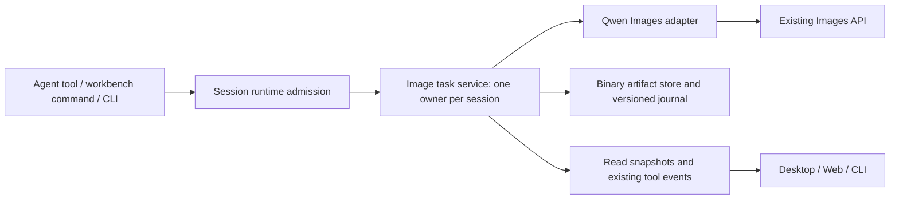

# Native image generation (v1)

Status: implemented; regional editing extension validated 2026-10-06. Baseline: upstream 29628c9, ZCode 3.14.3.

## Product contract

An optional native `GenerateImage` tool and a bundled `image-generation` skill
provide generation and ordered-reference editing through an authenticated Images
API. Desktop and Web share a workbench. CLI/TUI use the same execution service.
The initial adapter is Qwen-Image-2.1. Regional repainting uses a PNG alpha mask,
visual selection guidance and Host-side compositing; no agent-loop or proxy-side
model orchestration changes are required.

Existing configurations remain disabled. Image generation requires an explicitly
selected provider and never resolves the current conversation provider. Provider
credentials stay in the agent process. A request captures its provider before
execution; changing the conversation model cannot redirect an in-flight request.
The provider must be configured for API-key access. Account-only access without
an Images credential produces an actionable configuration error, not a fallback.

## Regional editing, session references and independent providers (v2)

### Canvas presentation refresh

The editor prioritizes the image with a large, quiet canvas and a slim header.
Prompt composition and the submit/cancel action remain anchored below the canvas;
no large permanent parameter form competes with the image. A compact thumbnail
history replaces the text-button version row. Zoom and edit mode live beside the
canvas, while repaint tools form a small floating toolbar above the image.

Provider configuration, output parameters and reference selection use explicit,
accessible popovers. Provider credentials are not shown in the main editing
surface. Existing independent provider settings, original artifact references,
comparison, download/export and parameter reuse remain available. The main
surface shows a clear setup action when image generation has not been configured.
The primary action is always visible at 390×844 and desktop sizes; settings
popovers scroll within the viewport without moving or covering their controls.

This is a presentation change within the `ui` module. `useImageWorkbenchDraft`
continues to own unsent drafts and selection, the mask editor owns unsent strokes,
and the session image service remains the only accepted-job owner. Popover state
is local and never submits work. Closing settings retains drafts and brush strokes.
Leaving selection mode clears the unsent mask while retaining the prompt and
references. Only one editing toolbar is shown at a time; the current target is
not repeated as an extra composer thumbnail while it is already on the canvas.
No network, credential, mask or persistence contract changes are required.

Acceptance: Chinese and English, light and dark themes, wide and 390px viewports,
keyboard popover dismissal/focus, visible composer action, history thumbnails,
reference ordering, brush/eraser/undo/clear, comparisons, download/export, cancel
and reload. Run actual Web and Electron flows, inspect screenshots with a real
photographic fixture as well as deterministic pixel-check fixtures, and run root
typecheck/lint and architecture checks. The layout takes inspiration from the
image-focused Codex editing workflow; it is not a pixel-identical copy of a
particular Codex release.

- The workbench can create/edit an independent API-key provider (name, base URL,
  key) through the existing environment-scoped ProviderSettings facade. The
  registry remains the sole credential owner; no key is put in image journals.
  Creating an image provider adds no chat model. Its ID is selected explicitly
  from the registry service's validated configuration snapshot. The chat-model
  registry excludes providers with no chat models and is not the image connection
  source. Enabled status and provider validation issues still gate image access.
  The settings picker uses these same connection criteria, not chat executability.
  in image settings (saved defaults for new sessions; the existing session owner keeps its effective settings). Missing/deleted providers fail before HTTP; legacy
  settings without providerId require selection once, never silently inherit a
  conversation provider. Model alias and request budget remain image settings.
- The reference picker shows all successful generated images in this session,
  including agent-origin images and older branches. It uses saved artifact IDs
  and previews, not reuploads or conversation text. Multi-select appends in click
  order, deduplicates, respects five total references, supports removal/reordering,
  and is isolated by session. Failed or incomplete jobs cannot be selected.
- Repaint selects a saved version as Picture 1. A scaled/zoomed canvas supports
  pointer/touch brushing, erasing, undo and clearing, with keyboard brush position
  and painting. Brush strokes are local draft state tied to that target. Changing
  the target/new image/session clears the selection. Empty selections cannot submit.
- On submit, the UI exports an original-size PNG alpha mask through the existing
  chunk import path, then submits `mask` (a session artifact ID) in the same image
  command. Transparent mask pixels mean repaint; opaque pixels mean preserve.
  CLI tools may use a workspace-local PNG mask path through the existing path
  boundary. Masks must match Picture 1 and requested dimensions; edits keep the
  original size and output PNG. Invalid/opaque masks fail before HTTP.
- Qwen's current Images API does not accept a mask part. The adapter highlights
  the selected region in a derived first reference and adds region instructions;
  original reference files stay untouched. After one edit request, it composites
  the result into the original using mask alpha, preserving every unselected RGBA
  pixel exactly. Soft edges use premultiplied alpha blending. Model quality within
  the selection is not guaranteed, and this is not native diffusion inpainting.
- The service owns accepted mask IDs, input, parent history and terminal state.
  Cancel/restart/late-result behavior is unchanged; upload alone does not enqueue
  a generation. Local controls are frozen while mask upload and submission run.
  List replies advertise optional `capabilities.maskEditing`; clients hide repaint
  against older image Hosts. Existing inputs without mask retain their behavior.

```mermaid
sequenceDiagram
  participant UI as Desktop/Web draft
  participant Registry as Provider registry
  participant Owner as Session image owner
  participant Adapter as Qwen adapter
  UI->>Registry: Save independent connection through Settings facade
  UI->>Owner: Import original-size mask (ordered chunks)
  UI->>Owner: Submit command ID + target/reference IDs + mask ID
  Owner->>Registry: Resolve explicit provider and capture credentials
  Owner->>Owner: Persist queued job; resolve and validate artifacts
  Owner->>Adapter: Single edit with signal and trace
  Adapter->>Adapter: Guide selected area; composite unchanged exterior
  Adapter-->>Owner: Original-size PNG
  Owner->>Owner: Persist artifact then success unless cancelled
  Owner-->>UI: Same snapshot owner for desktop and mobile replay
```

Acceptance additions: exact RGBA preservation outside irregular/soft selections;
correct scaled/touch/keyboard drawing and undo; empty/wrong-size/non-PNG masks
rejected before HTTP; mask persistence and workspace/session boundaries; ordered
session image reuse without import; separate chat/image endpoints and credentials;
provider reload/edit preserves secrets and does not redirect queued requests;
legacy settings migration; Web and Electron UI plus real CLI execution.

The workbench has a blank canvas, aspect-correct pending state, prompt, ordered
references, size, format, transparency, seed, advanced guidance/negative prompt
and JPEG quality. It supports iterative edits, regeneration, version selection,
side-by-side comparison, zoom and export. Reference slots include the edit target.
Draft changes never submit a request. No fabricated percentages or progressive
images are shown: the upstream API returns one completed image.

## Boundaries and ownership



- Shared: runtime-validated configuration, request, result, status and wire types.
- Contracts/core: optional `ImageGenerationPort`, tool declaration and permission
  integration. Core does not perform network or filesystem I/O.
- Adapters: bounded HTTP, original binary files, atomic journal and export I/O.
- Bootstrap: provider resolution, session-scoped service composition, admission,
  cancellation and protocol operations. No image business state in Electron Main.
- UI: hooks access the transport, components own only unsent drafts and view
  preferences. Accepted jobs are always read from the session owner.

Workspace identity uses the existing identity resolver. All operations are scoped
to the session and workspace owner; client-provided artifact IDs are looked up in
the journal, never interpreted as paths. Local path inputs from the native tool
are constrained by the existing workspace/permission boundary.

## API and lifecycle

`GenerateImage` takes an operation (`generate` or `edit`), prompt, ordered image
references, optional parent version, size, seed, background, output format,
guidance scale, negative prompt and JPEG quality. It returns a small structured
result with job/artifact identity, parent, effective parameters, dimensions,
format, seed and file references. It never returns image Base64 to the LLM.

The image service exposes submit, get/list, cancel, import/read and export. Both
explicit workbench submissions and model calls use that service and existing
permission/admission rules. Workbench operations retain their user-action origin;
they must not masquerade as model-authored tool calls.

States: queued, running, succeeded, failed, cancelled, interrupted. A command ID
is the idempotency identity within its session; resubmission with different input
is rejected. Completed jobs are immutable. Each edit creates a new version and
records its parent and reference order. Cancellation is terminal, and late HTTP
responses cannot overwrite it. A disconnected viewer does not cancel a request.
After an owner-process restart, unfinished records become interrupted without
resubmitting a POST. Explicit retry creates a new command/job.

Write binary artifacts before committing success metadata. Recoverable storage
failures cannot be reported as success. Preserve original inputs and outputs;
only preview images may be resized. Export uses a unique name under
`output/qwen-image/` unless the user selects another allowed destination.

Qwen defaults and constraints:

- Model alias `Qwen-Image-2.1`; preflight `GET /v1/models` with a 15-second budget.
- Generation: JSON `POST /v1/images/generations`; editing: multipart
  `POST /v1/images/edits`, repeated `image[]` parts in the selected order.
- One output, 40 steps, `b64_json`, CPU generator, guidance 1, cache disabled.
- Default 1024x1024, seed 42. Edits choose a fresh seed excluding known reference
  seeds unless explicitly supplied. Preserve reference transparency by default.
- Positive dimensions divisible by 32; ratio tolerance 2 percent. Limits:
  1:1 2048x2048; 4:3 2400x1792; 3:4 1792x2400; 3:2 2528x1696;
  2:3 1696x2528; 16:9 2752x1536; 9:16 1536x2752.
- PNG/JPEG only; transparency requires PNG and transparency prompt conditioning.
  Guidance above 1 requires a negative prompt; compression is JPEG-only.
- Editing requires 1–5 ordered PNG/JPEG references, up to 50 MiB each and 256 MiB
  total multipart. Generation JSON is at most 256 KiB; responses at most 128 MiB.
- Requests have a configurable 20-minute default deadline, propagated through
  tool and HTTP boundaries. Never transparently retry a generation POST.
- Model listing is not an authorization grant. Preserve 401/403/404/429/5xx
  distinctions without exposing credentials or unbounded provider error bodies.
- HTTP cancellation means the request was cancelled, not proof of GPU preemption.

## Compatibility and distribution

### Resolution-dependent reference capacity (v3)

The Qwen reference count must be bounded by measured output-resolution capacity,
not just the API maximum of five. Qualification uses serial requests, 40 steps,
CFG 1, CPU RNG, cache disabled, PNG, and distinct original reference images.
Record the upstream model/version, input dimensions/hashes, seed, decoded output
dimensions/hash, elapsed time, reported peak memory, and post-request health.
Test square resolution tiers and all seven maximum aspect-ratio sizes, repeat
the proposed safe boundary with different seeds, and include large references
and regional edits. Stop a run on failure, uncertain completion, or exhausted
memory headroom; never retry a generation automatically. Previously observed
OOM cells are evidence, not mandatory destructive retests. Measurements cannot
guarantee safety on another GPU, placement recipe, batching mode or workload.

The shared contract will expose the qualified size/count policy. The session
service remains the sole job owner and checks the effective references after
parent resolution, before accepting new work; the Qwen adapter checks again
before network I/O. Desktop/Web show the same limit and block submission with
an actionable message. Draft images are never silently dropped or resized.
The editing target counts once; the derived regional guide replaces it and
does not consume another slot. Persisted jobs retain the original input schema
so a stricter admission policy cannot break old history or reconnect snapshots.
No protocol version, storage migration, queue owner or replay semantics change.
The bundled tool guidance describes the limit for CLI/agent callers.

The admission tiers use output pixels (width × height), not the longest side:
up to 2,359,296: five references; up to 3,211,264: three;
larger supported sizes: two. Generation with zero references keeps the existing
size bounds. The policy is shared by admission, adapter, UI, and JSON tool-schema
guidance, but is deliberately not a refinement on the persisted input schema.
The high-resolution tier uses a uniform limit across all seven maximum aspect
ratios: each has completed with two references, while the maximum-area three-
reference request exits the tested upstream with OOM. The 1792-square tier has
an observed four-reference OOM. Early memory screening thresholds are experiment
controls, not the admission rule or a substitute for measuring the next count.

Acceptance: boundary and above-boundary tests for every size tier; implicit
parents; duplicate commands; zero upstream requests for rejected work; historical
job parsing; UI changes of size with existing references; Web and Electron
interaction; CLI errors; root/CLI type, lint and architecture checks. The final
measured table and limitations belong in a separate qualification report.

Live baseline findings: the desktop development package has no package version,
so Electron reports `0.0` and electron-updater fails before a window opens. Apply
the existing build version only for invalid development versions. Standalone Web
does not register the window-controller channel used by the shared task list.
Relocate the existing platform-independent controller runtime to the services
package, retain desktop re-export entrypoints, and register it in HTTP servers
only when a host has not already supplied a controller. Task/session persistence
and mutation policies continue to use the existing task and agent service ports.

Optional `imageGenerationV1` is negotiated before using new wire operations or
display metadata. A client only sends its capability after the host advertises
support because old clientHello validators reject unknown fields. Without
negotiation, project a regular tool result containing text and file references.
Keep both agent and UI schemas aligned; retain all existing protocol identifiers.

No core session-table migration. Versioned image journals are additive and live
under private session storage. Old conversations, tools, skills and configuration
continue to work when the feature is disabled. Images remain readable when off.
Bundled skill validation is feature-local: a missing image skill must not make
the existing bundled skills disappear. Include it in desktop, Node CLI/Web and
SEA asset collection. Fork desktop builds use the existing Preview identity and
disable upstream auto-update while keeping official build behavior intact.

## Acceptance

1. Unit/contract: valid and invalid dimensions, formats, seeds, 0/1/3/5/6 refs,
   transparency, effective defaults, response decoding and error classification.
2. Adapter with local fake HTTP server: body/part ordering, auth, URL joining,
   401/403/404/429/5xx, malformed/oversized data, cancellation and no duplicate POST.
3. Real delayed mock responses beyond 180 and 300 seconds; short configured
   deadlines verify cancellation without consuming GPU time.
4. State/storage: duplicate command, conflicting duplicate, refresh, reconnect,
   owner restart, late result, write failure, parent history, cross-session read,
   path boundaries and export collisions.
5. Web: development and packaged server, desktop/mobile layouts, both themes,
   both languages, keyboard, references, edits, comparison, download and recovery.
6. Electron: real application and Linux x64 package, resource discovery, imports,
   exports, resize, multiple sessions and restart. Document any dialog stubbing.
7. CLI: real TTY plus `-p`, `--attach`, `--resume`, text/json/stream-json,
   cancellation, output paths, event ordering and non-GUI execution.
8. Each surface: actual GLM tool selection followed by actual Qwen generation,
   targeted edit and transparent output. Shared real matrix: 512/1024 × 1/3/5 refs,
   PNG/JPEG and portrait/landscape. Serial calls; no known crashing GPU combinations.
9. Inspect screenshots and decoded image files; verify dimensions, MIME, alpha,
   reference order and preservation intent. HTTP success alone is insufficient.
10. Old config/history, feature off, mixed client/host versions, and normal agent
    workflows. Root/CLI typecheck and lint, architecture, changed-file formatting,
    builds and packaging. Report baseline failures separately.

Keep screenshots for blank/running/completed/editing/failed/recovered states,
redacted request metadata, terminal captures and image hashes in an ignored local
evidence directory. Commit only sanitized summaries and reproducible fixtures.
Linux is the required live platform. Windows/macOS receive applicable compatibility
and build checks, with unavailable target-host checks explicitly unverified.

## Maintenance

`main` tracks upstream; `custom/main` is the downstream integration branch.
Feature commits stay independently reviewable and replayable. Record required
registration points and test commands in the maintenance guide. Validate replay
and build in a clean checkout before declaring the feature complete.

### Image intent and optional asset gate

Alpha pixels are file metadata, never an instruction to remove a photographic background. Auto-background edits pass the user prompt unchanged and preserve reference bytes; only an explicit or inherited transparent request adds transparency text. Missing bundled image-generation/SKILL.md disables image submission and native-tool registration alone; old artifacts remain readable and other bundled skills remain available.

### Reproducible UI tests

`test:image-generation:web` and `test:image-generation:desktop` create isolated profiles under ignored `.evidence/automated/`, start a deterministic loopback Images provider, drive the actual built application with Playwright, assert original downloaded bytes and reference hashes, and save screenshots and request records. Their fixture provider is explicitly synthetic; it does not replace the separate live GLM/Qwen acceptance. File selection is simulated with `setInputFiles`, while host import/export bytes are real.

Test-only environment options: `ZCODE_IMAGE_TEST_BROWSER` selects an installed Playwright browser channel (default Chrome); `ZCODE_IMAGE_TEST_ELECTRON` selects a packaged application executable (default development Electron); `ZCODE_IMAGE_TEST_DISTRIBUTION` selects an unpacked CLI/Web distribution (default local build). These options affect test launchers only, never production behavior. An invalid path or unavailable browser fails the test. Build the agent, Web/server and desktop outputs first.

The CLI/Web distribution copies the complete bundled skill pack alongside the agent; it uses the same runtime discovery path as Desktop. This fixes missing skills when running outside the source checkout.

### Downstream package identity

Preview identity alone shares upstream business data. Downstream image packages therefore opt in through package metadata `zcodeImageWorkbench: true`, set by the custom build script (CLI builder flag `--image-workbench`, Electron Builder extraMetadata). Only these packages default to `~/.zcode-profiles/qwen-image/`; storage, settings, sessions and logs resolve beneath it. Existing explicit ZCODE directory overrides retain precedence. Ordinary upstream builds keep their existing defaults. Bootstrap applies the profile before importing services that capture environment paths. The custom desktop package uses Preview identity and the existing disabled-updater policy.

Narrow layouts keep the canvas/history column at its natural height and scroll the whole workbench body; the adjustment panel must never overlap version controls. E2E checks compare their actual bounding boxes after responsive transitions settle.

### Qwen JPEG compatibility

Live JPEG requests on the configured upstream return HTTP 500. The Qwen adapter therefore always requests lossless PNG once, validates it, and, only when JPEG was requested, composites alpha against white and encodes JPEG on the Host with the requested quality (default 90). It never retries a failed image request or changes providers. The saved artifact records `encoding: { sourceFormat: "png", quality, matte: "white" }`; effective input records the quality. Transparent-output requests still require PNG. References retain their original bytes and alpha. Tests assert a single PNG POST, JPEG magic bytes/dimensions, matte and metadata.

The existing ZCODE_DATA_BASE_DIR override also controls the default Agent config path (`.zcode/cli/config.json`). Explicit config file/base-directory arguments retain priority. This closes the legacy default-config path that otherwise bypassed downstream profile isolation. Builds respect an explicit Node heap budget and keep type emission and package resource collection sequential.

Read requests may select a canvas (1024px maximum edge) or reference (128px) preview. These derived bytes use a bounded session cache; originals, hashes, uploads and downloads are unchanged. Canvas zoom above 100% fetches the original. Previews preserve PNG alpha and are never used as edit inputs.

Native agent jobs select their newly accepted image version even when the user previously selected an older version; subsequent manual history selection is retained. Async UI actions discard results and errors if the session/active generation changed, preventing a late upload from becoming a reference in a different draft. Panel-origin jobs inherit the session trace context just like native tool jobs.

### Provider secret projection

Wire-level acceptance found pre-existing Settings and Model Selection facades exposing Provider API keys to the renderer. Their service boundary now replaces nonempty credential fields and authentication headers with a reserved saved-secret marker. The private Registry retains the real values. Returning an unchanged marker on save preserves the existing secret for that exact Provider; empty or newly entered values explicitly clear or replace it. A marker with no matching stored credential is rejected. All read, mutation response and change-event paths apply the same projection; legacy clients can continue submitting the same config shape. Tests cover reads/events, name-only saves, explicit replacement/clear, cross-provider isolation and browser WebSocket frames.

Saved-secret restoration executes inside the existing Provider mutation queue via an optional local facade callback, preventing a name-only update from restoring a credential that was rotated while the update waited. No new wire argument or parallel write queue is introduced.

Clean replay found that the desktop-agent builder intentionally omits the TUI. The downstream combined builder explicitly builds the complete `@zcode/tui...` runtime dependency closure serially, before CLI/Web asset collection. Command spawning reuses the repository Windows shim/path handling.

Mixed-version UI acceptance uses an optional `ZCODE_IMAGE_TEST_BASELINE` test-only path containing built official CLI and Web outputs. The harness can independently choose the Host server/agent executables and the static client root; it validates normal chat on an old Host and textual image results for an old client.

The source-only `@zcode/shared` package has no build script; the distribution builder also emits its TypeScript project explicitly before collecting the TUI dependency closure.

Sequential desktop builds reuse the upstream production-output cleanup before emitting main/host/renderer files, so stale development chunks cannot enter downstream packages.
